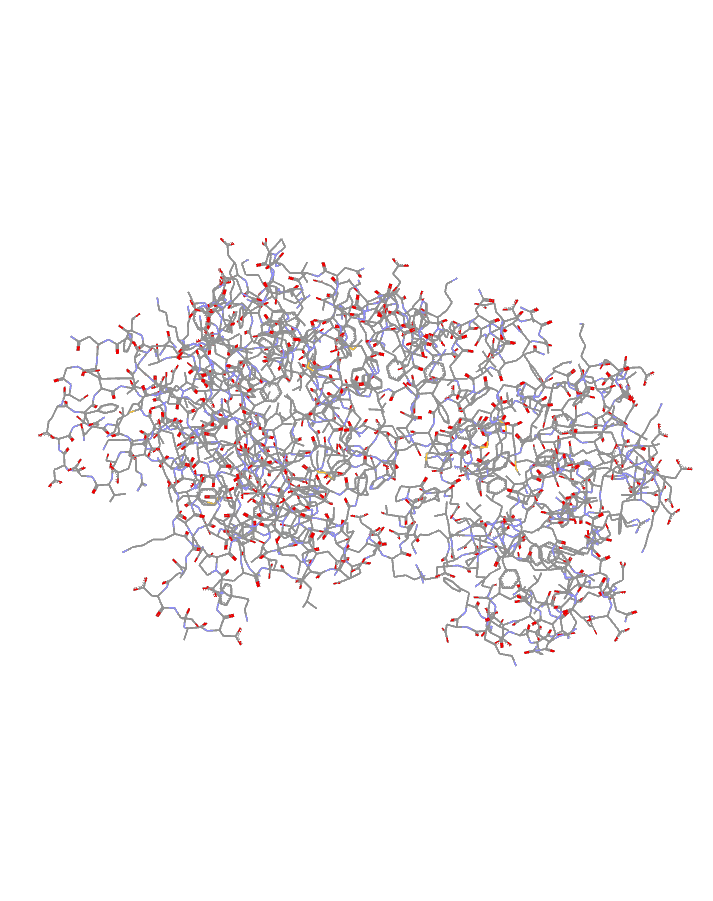
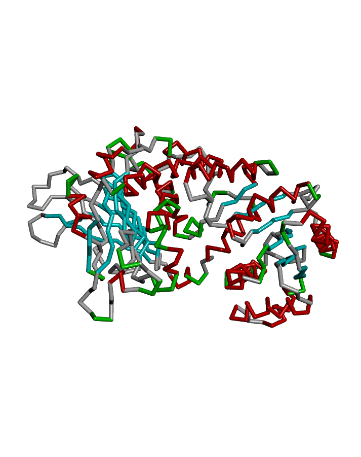
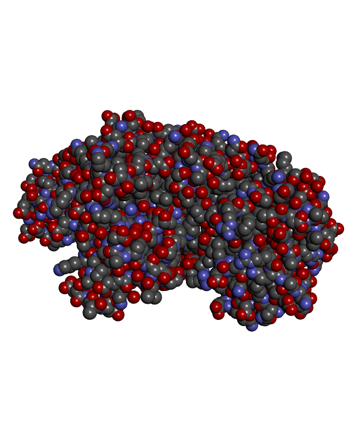
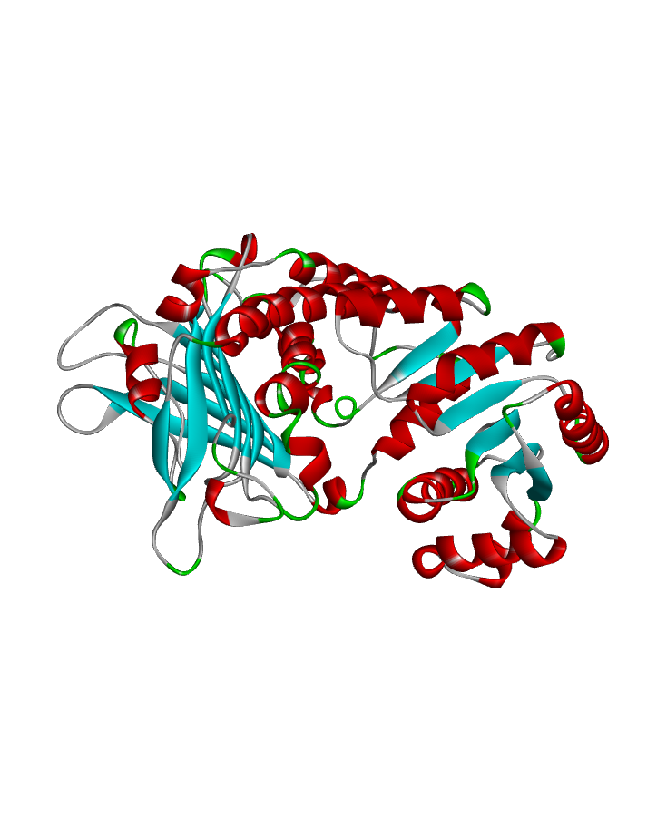
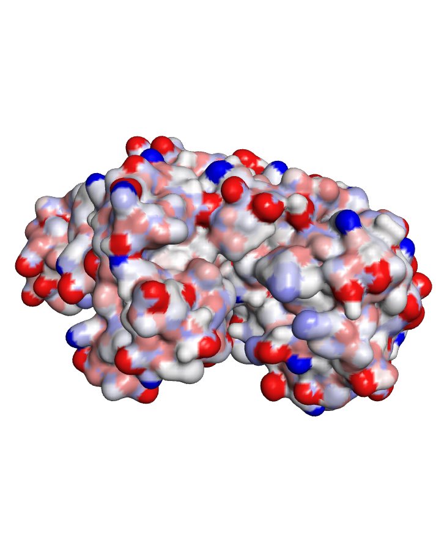
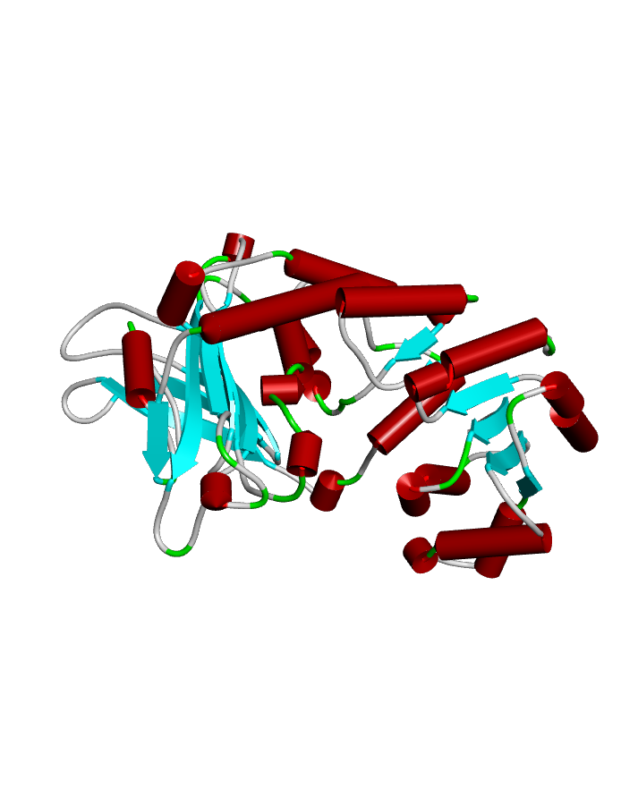

Название ПО: BIOVIA Discovery Studio Visualizer

Ссылка на выбранную структуру белка: https://www.rcsb.org/structure/1E77

## a. Wireframe

## b. Backbone

## c. Spacefill

## d. Ribbons

## e. Molecular surface

## f. Schematics

